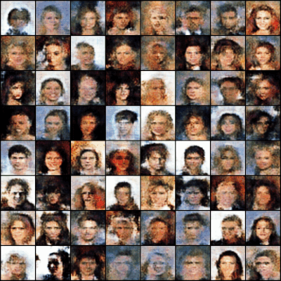

## 1. simple GAN 
[ [code](https://github.com/VedantG-02/pytorch-PlayGround/tree/main/GANs/simpleGAN) ]
### Description:
Generative Adversarial Networks (GANs) as the name suggests is a framework to estimate generative models via an adversarial training process, in which two models (generator and discriminator) are trained simultaneously and the job of generator is to trick discriminator in identifying the data to be real or fake. As training proceeds, discriminator improves its ability to identify real/fake, and thus generator also improves its ability to produce (fake) images which seems more real-like. This is the main idea behind gans. Mathematically, this translates to sampling a **_z_** from a given prior **_p<sub>z</sub>_** and passing it through generator **_G_** to generate **_G(z)_** which follows a distribution similar to **_p<sub>r</sub>_**, where **_p<sub>r</sub>_** is the distribution of real data. The training aims to minimize the Jensen-Shannon Divergence (JSD) between the real and fake distribution, and the exact formulation of the losses corresponding to generator and discriminator is given in the paper (linked below). I have implemented the exact algo as mentioned in the original paper, with value of k=1 (Using JSD doesn't provide training stability, and as can be seen in the WGAN section, the reason of using Wasserstein distance was primarily the stability it provides while the trade-off being more computation because of slower convergence). I used [Celeb Faces](https://www.kaggle.com/datasets/farzadnekouei/50k-celebrity-faces-image-dataset?resource=download) dataset available on kaggle to train all gan variants and the results I obtained (training progress) is shown below in the form of a gif :).

Paper Link : [GAN paper](https://arxiv.org/abs/1406.2661)

<p align="center">

</p>

To run the script, first clone the repo in your machine, and ``cd`` to ``GANs/simpleGAN/`` and run;
```sh
python train.py
```
Or to access the tensorboard (if you don't have it, install using ``pip install tensorboard``), run:
```sh
tensorboard --logdir=tensorboard/runs
```

## 2. DCGAN 
[ [code](https://github.com/VedantG-02/pytorch-PlayGround/tree/main/GANs/DCGAN) ]
### Description:
Deep Convolutional GAN uses fully convolutional networks (FCNs) as both generator and discriminator as compared to MLPs in original GAN. Authors also stated architecture guidelines for stable dcgans which are as follows: Replace any pooling layers with (fractional-)strided convolutions in order to let model learn its spatial downsampling itself. Use batchnorm to stabilize training and helping in case of poor initialization they say. Remove fully connected dense layers for deeper architectures. Use ReLU in generator and LeakyReLU in discriminator. Micro/macro training details can be found in the paper itself. I used learning rate equal to 5e-5 (different from authors; they used 2e-4), trained for 50 epochs and the results I obtained (training progress) is shown below in the form of a gif :).
 
Paper Link : [DCGAN paper](https://arxiv.org/abs/1511.06434)
<p align="center">

</p>

To run the script, first clone the repo in your machine, and ``cd`` to ``GANs/DCGAN/`` and run;
```sh
python train.py
```
Or to access the tensorboard (if you don't have it, install using ``pip install tensorboard``), run:
```sh
tensorboard --logdir=tensorboard/runs
```

## 3. Wasserstein GAN 
[ [code](https://github.com/VedantG-02/pytorch-PlayGround/tree/main/GANs/WGAN) ]
### Description:
WGAN paper is nicely written with MUCH mathematical analysis and proofs, and proper evidence to support the design decisions made (I still need to understand it more than I do now). Authors covered different distances (and their formulations) to measure 'distance' between prob distributions, one of them being the Earth-Mover (EM) or Wasserstein-1 distance. EM can be viewed as a 'transport plan' to convert one distribution to another by taking out a portion of 'mass' from a certain part and adding it to some other part, in order to change the distribution, which roughly justifies the name it got. Paper also provides an example to show that not all sequences of distributions converge under JSD, KL, reverse KL and TV divergences, but they do converge under the EM distance and why using EM is a better idea. Now, all this works only when the critic (analogous to discriminator but not exactly discriminator as it is not giving a probability of being real/fake as with previous variants) is k-Lipschitz continuous (more on this in paper), and to guarantee this - weight clamping within [-0.01, 0.01] is done on the weights after every update (which according to authors themselves is a terrible way to enforce a Lipschitz constraint). Btw, what does it mean for a function to be k-Lipschitz continuous? It's a property which if is true for a function that means the function does not change too rapidly; in other words - the difference in the function's output between any two points is bounded by a constant times (k) the distance between those points. This is just an overview of what's been done in the paper and refer it as and when required. I used RMSProp to optimize the networks with a learning rate of 5e-5, trained for 30 epochs and the results I obtained (training progress) is shown below in the form of a gif :).

Paper Link : [WGAN paper](https://arxiv.org/abs/1701.07875)

<p align="center">

</p>

To run the script, first clone the repo in your machine, and ``cd`` to ``GANs/WGAN/`` and run;
```sh
python train.py
```
Or to access the tensorboard (if you don't have it, install using ``pip install tensorboard``), run:
```sh
tensorboard --logdir=tensorboard/runs
```

## 4. Wasserstein GAN (with gradient penalty) 
[ [code](https://github.com/VedantG-02/pytorch-PlayGround/tree/main/GANs/WGAN-GP) ]
### Description:
Enforcing 1-Lipschitz constraints using weight clamping is a terrible idea and often leads to sub-optimal critic that could sometimes yields poor performance, and thus authors of this paper (linked below) replaced weight clamping with gradient penalty (GP). GP can be seen as a regularization technique used in WGAN to enforce the same lipschitz constraint we're talking about, where it directly penalizes the gradients of critic's output ensuring they have a norm (L2) of at max 1. Process of calculating GP is given in the algo mentioned in paper. I used Adam to optimize the networks with a learning rate of 1e-4, trained for 30 epochs and the results I obtained (training progress) is shown below in the form of a gif :).
 
Paper Link : [WGAN-GP paper](https://arxiv.org/abs/1704.00028)

<p align="center">

</p>

To run the script, first clone the repo in your machine, and ``cd`` to ``GANs/WGAN-GP/`` and run;
```sh
python train.py
```
Or to access the tensorboard (if you don't have it, install using ``pip install tensorboard``), run:
```sh
tensorboard --logdir=tensorboard/runs
```
